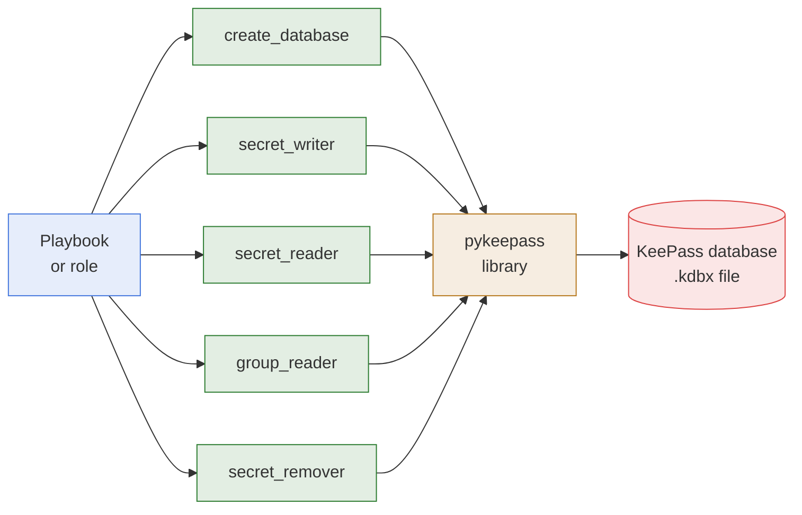

# Ansible Collection - hasnimehdi91.keepass

- **What it is:** an Ansible collection that manages the secrets of a KeePass database from a
  playbook or a role. It creates a database, writes secrets, reads them one by one or by
  group, and removes them.
- **How it runs:** five modules, each one task in a playbook, called by their fully qualified
  name `hasnimehdi91.keepass.<module>`. Each task opens the database file with its password,
  does one thing, and saves the file when something changed.
- **How it is shaped:** every module is one self-contained Python file built on the
  `pykeepass` library. There is no server, no agent, and nothing kept open between tasks.

## Architecture



## Installation

- **Requirements:** ansible-core `2.15.8` or newer, and Python 3 with `pykeepass==4.0.6` on
  the host where the modules run, which is usually the control node.

```bash
pip install 'pykeepass==4.0.6' --user
ansible-galaxy collection install hasnimehdi91.keepass
```

## Operations

| Operation | Module | Detailed Description |
| --- | --- | --- |
| Create an empty database | `hasnimehdi91.keepass.create_database` | [create_database](docs/modules/create-database.md) |
| Write a secret | `hasnimehdi91.keepass.secret_writer` | [secret_writer](docs/modules/secret-writer.md) |
| Read a secret | `hasnimehdi91.keepass.secret_reader` | [secret_reader](docs/modules/secret-reader.md) |
| Read the secrets of a group | `hasnimehdi91.keepass.group_reader` | [group_reader](docs/modules/group-reader.md) |
| Remove a secret or a group | `hasnimehdi91.keepass.secret_remover` | [secret_remover](docs/modules/secret-remover.md) |

A short playbook that writes a secret and reads it back:

```yaml
- name: Write and read a secret
  hosts: localhost
  connection: local
  gather_facts: false
  tasks:
    - name: Write secret
      hasnimehdi91.keepass.secret_writer:
        db_path: "secrets.kdbx"
        db_password: "password"
        secret_path: "foo/bar"
        secret_value:
          username: "John"
          password: "Doe"
      no_log: true

    - name: Read secret
      hasnimehdi91.keepass.secret_reader:
        db_path: "secrets.kdbx"
        db_password: "password"
        secret_path: "foo/bar"
      register: bar
      no_log: true
```

One runnable playbook per module is in [Examples](docs/examples/README.md).

## Documentation

- **Architecture:** [Architecture](docs/architecture/README.md), the hub of
  [High Level Architecture](docs/architecture/high-level-architecture.md) and
  [Paths And Return Values](docs/architecture/paths-and-return-values.md).
- **Modules:** [Modules](docs/modules/README.md), the hub of
  [create_database](docs/modules/create-database.md),
  [secret_writer](docs/modules/secret-writer.md),
  [secret_reader](docs/modules/secret-reader.md),
  [group_reader](docs/modules/group-reader.md), and
  [secret_remover](docs/modules/secret-remover.md).
- **Examples:** [Examples](docs/examples/README.md), one runnable playbook per module.
- **Development:** [Development Environment](docs/development/development-environment.md),
  [Testing](docs/development/testing.md), [Release](docs/development/release.md),
  [Wiki](docs/development/wiki.md), and the [Runbook](docs/runbook.md), every `make` target.

- **Automation:** [GitHub Actions](docs/ci/github-actions.md), the workflows and their
  secrets.

## Process And Policy

- **Contributing:** [CONTRIBUTING.md](CONTRIBUTING.md), how to propose a change.
- **Security:** [SECURITY.md](SECURITY.md), how to report a vulnerability, and what the
  collection does and does not protect.
- **Engineering rules:** [CLAUDE.md](CLAUDE.md), how every file of the repository is written.
- **License:** [MIT](LICENSE).

## Scope

- **In scope:** creating a KeePass database, and reading, writing, and removing its secrets
  and groups, with a password.
- **Out of scope:** key files, attachments, the history of a secret, the encryption settings
  of a database, and editing a secret in place. A secret is replaced as a whole with `force`.
