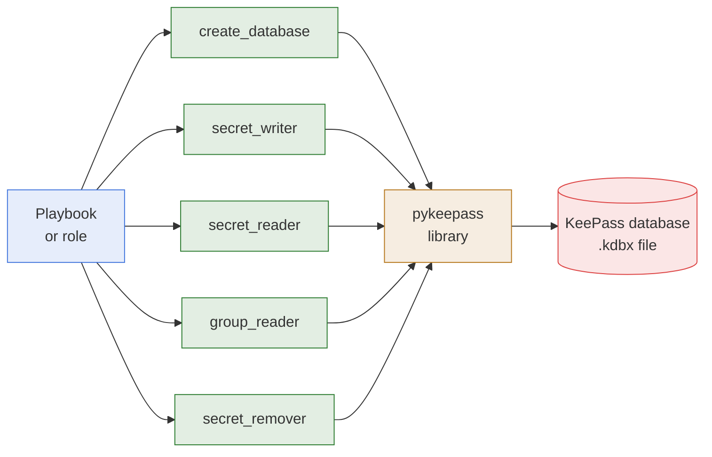

# High Level Architecture

- **What it is:** five Ansible modules that create, read, write, and remove secrets in a
  KeePass database file. Each module is one self-contained Python file.
- **What it depends on:** the `pykeepass` library, which opens and saves the database. It
  must be installed on the host where the module runs.
- **What it never does:** it never contacts a server and never keeps a database open between
  tasks. Every task opens the file, does one thing, and saves it when something changed.

## Architecture

## Where A Module Runs

- **On the host of the task.** Like any Ansible module, a module of this collection runs on
  the host the task targets. `db_path` is a path on that host, and `pykeepass` must be
  installed there.
- **On the control node, most of the time.** A secrets database usually lives beside the
  playbooks. Run the task with `connection: local`, or with `delegate_to: localhost`, to read
  it on the control node and use the secret on the remote hosts.

## How A Task Flows

- **Arguments:** Ansible checks the arguments of the task against the options of the module
  and masks `db_password` in every output.
- **Library check:** the module fails with a clear message when `pykeepass` is not installed.
- **Open:** the module opens the database with `db_password`. A wrong password fails the
  task with `Invalid credentials`.
- **Work:** one worker function reads, writes, or removes.
- **Save:** the database is saved only when something changed, and the task reports
  `changed` accordingly. The two reader modules never report a change.

## Read And Write Modules

- **Read only:** [secret_reader](../modules/secret-reader.md) and
  [group_reader](../modules/group-reader.md) never write to the database.
- **Write:** [create_database](../modules/create-database.md),
  [secret_writer](../modules/secret-writer.md), and
  [secret_remover](../modules/secret-remover.md) change the database file.

## Related Documentation

- [Paths And Return Values](paths-and-return-values.md)
- [Modules](../modules/README.md)
