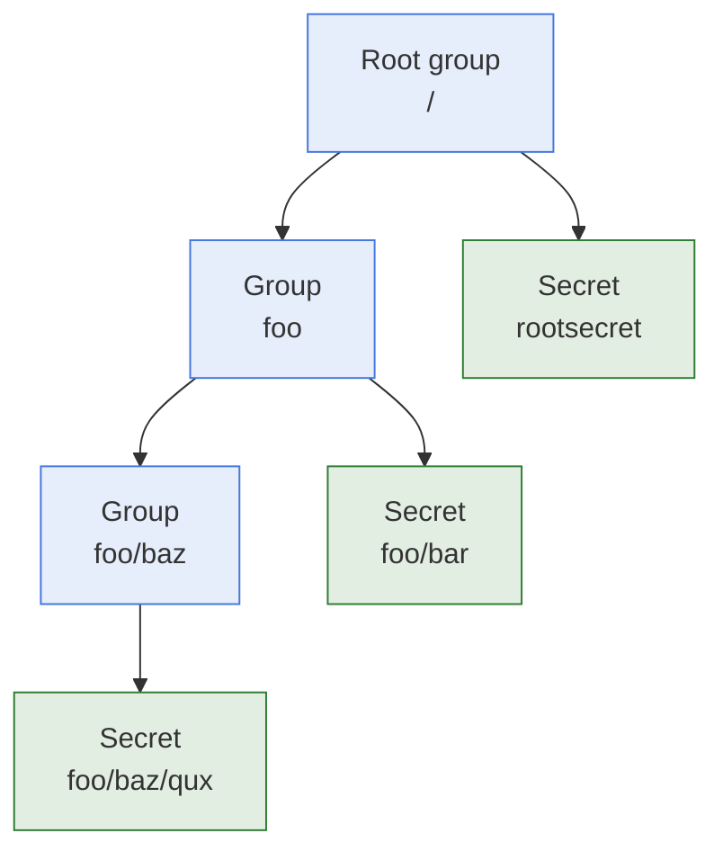

# Paths And Return Values

- **What it is:** the two conventions every module shares. A path says where a secret or a
  group is in the database. A returned secret is a dictionary keyed by its title.
- **Who reads it:** anyone writing a playbook that passes a path to a module or uses what a
  module returns.

## Paths



- **Separator:** a path is the names of the groups followed by the title of the secret,
  separated by `/`. The secret `qux` in the group `baz` of the group `foo` is `foo/baz/qux`.
- **Leading slash:** it is optional. `foo/bar` and `/foo/bar` are the same path.
- **Root group:** a secret stored in the root group is addressed by its title alone,
  `rootsecret` or `/rootsecret`.
- **Empty path:** a path that is empty or only spaces fails the task.

## Returned Secret

A secret is returned as a dictionary with one key, the title of the secret:

```yaml
secret:
  bar:
    username: "John"
    password: "Doe"
    gender: "Male"
```

- **`username` and `password`:** present only when they are set on the secret.
- **Custom properties:** every custom property of the secret is returned beside the username
  and the password, under its own name. `gender` above is one.
- **`url`:** it is stored in the database and is not returned.

## Returned Group

A group is returned as a list of secrets, each in the shape above:

```yaml
group:
  - bar:
      username: "John"
      password: "Doe"
  - dup:
      username: "dup"
      password: "dup"
```

- **Direct secrets only:** the secrets of sub-groups are not included.

## Missing Targets

- **Not a failure:** a secret or a group that does not exist returns an empty value,
  `secret: {}` or `group: []`, and the task succeeds.
- **Test it in the playbook:** check `secret | length > 0` before using the value.

## Related Documentation

- [High Level Architecture](high-level-architecture.md)
- [Modules](../modules/README.md)
