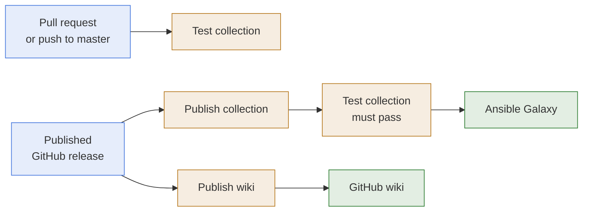

# GitHub Actions

- **What it is:** the three workflows of the repository. One tests every change, one publishes
  the collection to Ansible Galaxy, and one publishes the wiki.
- **How they run:** each job calls the same `make` targets a developer runs locally, so a
  failure in a workflow is reproduced with the same command on a workstation.
- **What triggers a publication:** a GitHub release. Publishing one release publishes the
  collection and the wiki.

## Run Model

## Workflows

| Workflow | File | Runs on | Make targets |
| --- | --- | --- | --- |
| Test collection | `.github/workflows/test_collection.yml` | Pull requests, pushes to `master`, manual run | `lint_source_code`, `run_unit_tests`, `run_integration_tests`, `run_sanity_tests` |
| Publish collection | `.github/workflows/publish_collection.yml` | A published release, manual run | `build_collection`, `publish_collection` |
| Publish wiki | `.github/workflows/publish_wiki.yml` | A published release, manual run | `publish_wiki` |

## Test Collection

- **Matrix:** three jobs, one per supported ansible-core line.

| ansible-core | Python | Sanity tests |
| --- | --- | --- |
| 2.15, the lowest supported version | 3.11 | no |
| 2.17 | 3.12 | no |
| The newest that `requirements.txt` allows | 3.12 | yes |

- **Independent jobs:** a failing version does not stop the others, so one run shows the
  result of every version.
- **Sanity on the newest only:** the sanity ignore file is named after one ansible-core
  version. When the newest ansible-core moves to a new line, add the ignore file of that
  line under `tests/sanity/`.

## Publish Collection

- **Tests first:** the workflow runs the whole test matrix, and publishes only when every job
  passes.
- **Token check:** it fails before building when the `GALAXY_TOKEN` secret is not set.
- **Version check:** on a release, it fails when the release tag and the `version` of
  `galaxy.yml` differ. The tag `v1.1.0` matches the version `1.1.0`.
- **Artifact:** the built file is attached to the workflow run, so what was published can be
  downloaded later.
- **One at a time:** two publish runs never run together, because Galaxy never lets a
  published version be replaced.

## Publish Wiki

- **What it publishes:** the documentation of the released version, built by
  `make publish_wiki`. See [Wiki](../development/wiki.md).
- **Nothing to push:** the run changes nothing when the wiki already matches the docs.
- **Once, by hand:** enable the wiki in the repository settings and create its first page in
  the browser. The workflow fails until that is done.

## Secrets

| Secret | Used by | What it is |
| --- | --- | --- |
| `GALAXY_TOKEN` | Publish collection | An Ansible Galaxy API token with rights on the `hasnimehdi91` namespace. Create it in the repository settings, under Secrets and variables, Actions. |

The wiki workflow needs no secret. It pushes with the token GitHub gives every workflow run.

## Release

1. Set `version` in `galaxy.yml`, and merge to `master`.
2. Publish a GitHub release whose tag is `v` followed by that version.
3. Watch the "Publish collection" and "Publish wiki" runs in the Actions tab.

## Action Versions

- **Dependabot:** `.github/dependabot.yml` opens a pull request each month when an action
  used by the workflows has a new version. It watches the actions only, not the Python
  packages.

## Related Documentation

- [Release](../development/release.md)
- [Testing](../development/testing.md)
- [Runbook](../runbook.md), every `make` target.
