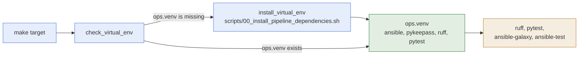

# Development Environment

- **What it is:** the local setup used to change the collection: one Python virtual
  environment, a formatter, and a linter, all driven by `make`.
- **Who reads it:** anyone who changes a module, a test, or a doc of this repository.
- **What you need first:** `make`, `bash`, and Python 3.12 available as `python3.12`.

## How It Fits Together

## Virtual Environment

- **One environment:** `ops.venv` at the repository root, built from `requirements.txt`.
- **Created on demand:** every `make` target checks for it first and builds it when it is
  missing. You do not create it by hand.
- **Rebuild:** `make install_virtual_env` removes it and builds it again from scratch. Run it
  after `requirements.txt` changes.
- **Dependencies:** `requirements.txt` lists only what is used directly, each with a comment:
  a version range for `ansible`, `ruff`, and `pytest`, and an exact version for `pykeepass`.

## Formatting And Linting

- **Format:** `make format_source_code` rewrites the Python files under `plugins/` and
  `tests/` with `ruff format`.
- **Lint:** `make lint_source_code` checks the formatting and the lint rules and changes
  nothing. It fails when a file needs formatting or breaks a rule.
- **Settings:** the line length, the quote style, and the rule families live in
  `pyproject.toml`.

## Running A Module From The Checkout

- **`ansible.cfg`:** the file at the repository root points Ansible at `plugins/modules`, so a
  playbook run from the repository root uses the modules of the checkout by their short name,
  for example `secret_reader`, without installing the collection.
- **Inventory:** it expects an `inventory.ini` at the repository root, which each developer
  creates. The file is ignored by git.

## Related Documentation

- [Testing](testing.md)
- [Release](release.md)
- [Runbook](../runbook.md), every `make` target.
