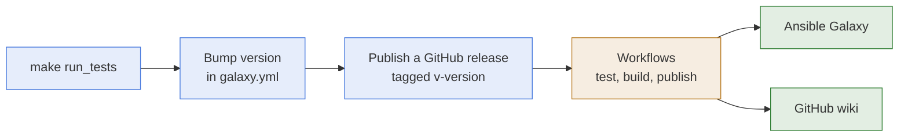

# Release

- **What it is:** the steps that turn the repository into a new version of the collection on
  Ansible Galaxy.
- **Who does it:** a maintainer with rights on the `hasnimehdi91` namespace of Galaxy.
- **What cannot be undone:** a published version cannot be replaced. A mistake is fixed by
  publishing a higher version.

## Flow

## Steps

1. **Test:** run `make run_tests`. Every layer must pass.
2. **Version:** set `version` in `galaxy.yml`. A new module or option raises the middle
   number, a fix raises the last one.
3. **Commit:** commit the version bump alone, with the subject
   `:100: Deploy release v<version>`, and merge it to `master`.
4. **Publish:** publish a GitHub release whose tag is `v<version>`. The workflows test, build,
   and publish the collection to Galaxy, and publish the wiki. See
   [GitHub Actions](../ci/github-actions.md).

## Publish By Hand

- **When:** only when the workflows cannot be used.
- **Build:** `make build_collection` writes the artifact to `dist/`.
- **Publish:** `export GALAXY_TOKEN=<token>`, then `make publish_collection`. The token is the
  Galaxy API token of the namespace. Pass it in the environment, never on the command line.
- **Wiki:** `make publish_wiki`, see [Wiki](wiki.md).

## What The Artifact Contains

- **Included:** `plugins/`, `meta/`, `docs/`, `README.md`, and `LICENSE`.
- **Excluded:** the tests, the virtual environment, the `Makefile`, the scripts, the
  configuration files, and every database. The list is `build_ignore` in `galaxy.yml`.

## Related Documentation

- [Testing](testing.md)
- [Runbook](../runbook.md), every `make` target.
