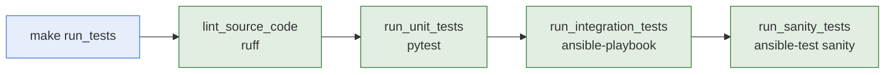

# Testing

- **What it is:** the four layers of checks of the collection. Each one is a `make` target,
  and `make run_tests` runs them all.
- **What it needs:** nothing beyond the development environment. The modules only read and
  write a local file, so no server and no virtual machine is involved.
- **Where the databases go:** every database a test creates is written to `tests.local/`.

## Layers



| Target | What it checks |
| --- | --- |
| `make lint_source_code` | The Python code is formatted and passes the lint rules. |
| `make run_unit_tests` | The worker functions and the modules behave as documented. |
| `make run_integration_tests` | The built and installed collection works from a playbook. |
| `make run_sanity_tests` | The modules and their documentation pass `ansible-test sanity`. |
| `make run_tests` | Runs the four above, in that order, and stops at the first failure. |

## Unit And Module Tests

They live in `tests/unit/plugins/modules/`, one file per module, and run with `pytest`.

- **Worker tests** (`test_worker_*`): call the worker functions directly against a real
  database.
- **Module tests** (`test_module_*`): run the module file the way Ansible runs it and check
  the JSON it prints. They cover the arguments, check mode, the failure messages, the masking
  of the database password, and the message shown when `pykeepass` is missing.
- **No mocks:** every test works on a real database file.

Run one file or one test with `pytest` from the repository root:

```bash
source ops.venv/bin/activate
pytest tests/unit/plugins/modules/test_secret_remover.py
pytest -k test_worker_removes_entry
```

## Integration Tests

- **Playbook:** `tests/integration/playbook.yml` calls every module by its fully qualified
  name and asserts each result.
- **What runs:** `make run_integration_tests` builds the collection, installs it into
  `tests.local/collections`, and runs the playbook on localhost against that installed copy,
  not against the checkout.

## Sanity Tests

- **What runs:** `make run_sanity_tests` installs the built collection into a temporary
  directory and runs `ansible-test sanity` there.
- **Network:** the first run downloads the requirements of the checks.
- **Ignored checks:** `tests/sanity/ignore-2.20.txt` lists the two checks that do not apply to
  this collection, the GPLv3 header and the position of the imports. The number in the file
  name is the ansible-core version. A new ansible-core version needs its own file.

## Test Databases

- **Location:** `tests.local/` at the repository root, each database with a random file name.
- **Never deleted:** the tests remove nothing from that directory, so a database can be
  opened after a failure. Empty the directory by hand when it grows.
- **Not shipped:** the directory is ignored by git and is not part of the built collection.
- **Password:** every test database opens with `password`.

## Related Documentation

- [Development Environment](development-environment.md)
- [Runbook](../runbook.md), every `make` target.
