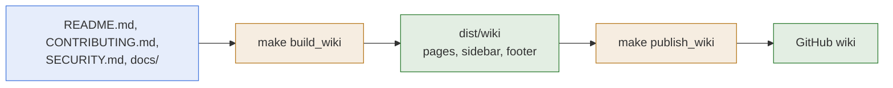

# Wiki

- **What it is:** the GitHub wiki of the repository, generated from the documentation. The
  pages under `docs/` are the only source, and the wiki is a published copy of them.
- **What it means for you:** never edit a page in the wiki. Edit it under `docs/`, then
  publish. A page edited by hand in the wiki is overwritten by the next publication.

## Flow

## What The Build Does

- **Pages:** every page under `docs/`, plus `CONTRIBUTING.md` and `SECURITY.md`, becomes one
  wiki page named after its title. `README.md` becomes the `Home` page.
- **Links:** a link to another page becomes a link to its wiki page. A link to any other file,
  such as an example playbook, becomes a link to the file in the repository.
- **Sidebar:** one section per directory of `docs/`, with the pages in the order the hub page
  of the directory lists them.
- **Footer:** a line that says the wiki is generated and where to edit.
- **Checks:** the build fails when a page links to a file that does not exist, or when two
  pages have the same title.

## Publish

1. **Once:** enable the wiki in the settings of the GitHub repository, and create its first
   page in the browser. The wiki has no git repository before that.
2. **Build and look:** run `make build_wiki` and read the pages in `dist/wiki`.
3. **Publish:** run `make publish_wiki`. It replaces every page of the wiki by the built
   ones and pushes. It pushes nothing when the wiki is already up to date.

## Related Documentation

- [Development Environment](development-environment.md)
- [Runbook](../runbook.md), every `make` target.
