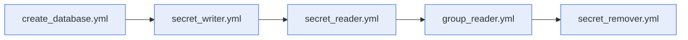

# Examples

- **What this directory holds:** one runnable playbook per module. Each one runs on localhost
  against a database named `secrets.kdbx`, created beside the playbooks.
- **How to run one:** install the collection, then run the playbook with `ansible-playbook`.

```bash
ansible-galaxy collection install hasnimehdi91.keepass
ansible-playbook create_database.yml
```

## Playbooks

Run them in this order to follow a secret from its creation to its removal:



| Playbook | What it does | Module page |
| --- | --- | --- |
| [create_database.yml](create_database.yml) | Creates `secrets.kdbx`. | [create_database](../modules/create-database.md) |
| [secret_writer.yml](secret_writer.yml) | Writes the secret `foo/bar/secret`. | [secret_writer](../modules/secret-writer.md) |
| [secret_reader.yml](secret_reader.yml) | Reads the secret `foo/bar/secret`. | [secret_reader](../modules/secret-reader.md) |
| [group_reader.yml](group_reader.yml) | Reads the secrets of the group `foo/bar`. | [group_reader](../modules/group-reader.md) |
| [secret_remover.yml](secret_remover.yml) | Removes the secret, then the group `foo` and its content. | [secret_remover](../modules/secret-remover.md) |

The password in these playbooks is a placeholder. In a real playbook, take `db_password` from
Ansible Vault or from a prompt, never from a file committed in clear text.
