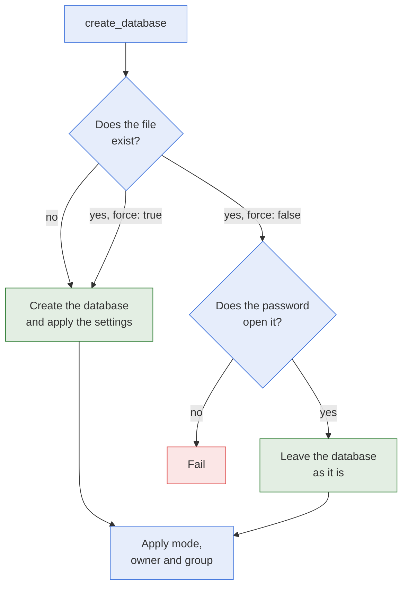

# create_database

- **What it is:** the module that creates a fresh, empty KeePass database at a path.
- **What it protects:** an existing database is never replaced or modified unless you set
  `force: true`.
- **What it returns:** the path of the database. No secret value is returned.

## Flow



## Options

| Option | Type | Required | Default | Meaning |
| --- | --- | --- | --- | --- |
| `db_path` | path | yes | | Path of the database file. The parent directory must exist. |
| `db_password` | str | yes | | Password of the database. |
| `force` | bool | no | `false` | Replace an existing database by an empty one. Every secret in it is lost. |
| `mode` | raw | no | `"0600"` | Permissions of the database file. |
| `owner` | str | no | | Owner of the database file. |
| `group` | str | no | | Group of the database file. |
| `db_name` | str | no | `""` | Database name. |
| `db_description` | str | no | `""` | Database description. |
| `db_default_username` | str | no | `""` | Username proposed for new entries. |
| `recycle_bin_enabled` | bool | no | `true` | Whether removed items go to the recycle bin in a KeePass application. |
| `history_max_items` | int | no | `10` | Number of history versions kept per entry. |
| `history_max_size` | int | no | `6291456` | Size in bytes of the history kept per entry. |

`mode`, `owner`, and `group` behave as in the `file` module of Ansible. The other standard
file options of Ansible, such as the SELinux ones, are accepted too.

## Behaviour

- **New database:** the database is created with the settings above. `changed: true`.
- **Existing database, `force: false`:** the content is left as it is, and the settings are
  not applied. The password must open the database, otherwise the task fails.
- **Existing database, `force: true`:** it is replaced by an empty one. `changed: true`.
- **File attributes:** `mode`, `owner`, and `group` are corrected on every run when they
  differ, including on an existing database. That reports `changed: true`.
- **Later writes keep the permissions:** `secret_writer` and `secret_remover` keep the
  permissions of the database file when they save it.
- **Missing parent directory:** the task fails and names the directory.
- **Check mode:** reports `changed` as it would be. Nothing is written.
- **Safe write:** the database is written to a temporary file and moved into place, so a
  failed run never leaves a half-written database.
- **Encryption:** the encryption algorithm, the key derivation, and the database format are
  the ones `pykeepass` gives a new database. They are not options.

## Return Values

| Key | Type | Meaning |
| --- | --- | --- |
| `changed` | bool | Whether the database or its file attributes changed. |
| `failed` | bool | Whether the task failed. |
| `path` | str | Path of the database. |

## Examples

Create a database:

```yaml
- name: Create database
  hasnimehdi91.keepass.create_database:
    db_path: "keys.kdbx"
    db_password: "password"
```

Create a database with settings and file ownership:

```yaml
- name: Create database with settings
  hasnimehdi91.keepass.create_database:
    db_path: "/foo/bar/keys.kdbx"
    db_password: "password"
    db_name: "Foo"
    db_description: "Foo secrets"
    db_default_username: "John"
    owner: "john"
    group: "john"
    mode: "0640"
```

## Related Documentation

- [secret_writer](secret-writer.md), which fills the database.
- [Modules](README.md)
