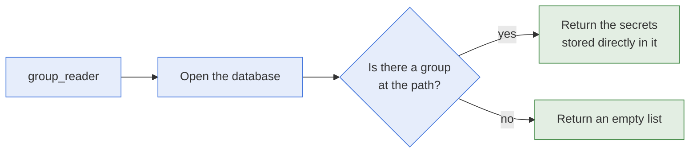

# group_reader

- **What it is:** the module that reads the secrets of one group of a KeePass database.
- **What it returns:** a list of secrets, each a dictionary keyed by its title.
- **What it never does:** it never writes to the database, and always reports
  `changed: false`.

## Flow



## Options

| Option | Type | Required | Meaning |
| --- | --- | --- | --- |
| `db_path` | str | yes | Path of the database file. |
| `db_password` | str | yes | Password of the database. |
| `group_path` | str | yes | Path of the group. |

## Behaviour

- **Direct secrets only:** the secrets of sub-groups are not returned. Call the module once
  per sub-group to read them.
- **Missing or empty group:** the task succeeds and returns `group: []`.
- **Missing database or wrong password:** the task fails.
- **Check mode:** the database is not opened, and no secret is returned.
- **`url`:** it is not returned.

## Return Values

| Key | Type | Meaning |
| --- | --- | --- |
| `changed` | bool | Always `false`. |
| `failed` | bool | Whether the task failed. |
| `path` | str | Path of the group. |
| `group` | list | The secrets of the group. See [Paths And Return Values](../architecture/paths-and-return-values.md). |

## Examples

Read the secrets of a group:

```yaml
- name: Read group secrets
  hasnimehdi91.keepass.group_reader:
    db_path: "keys.kdbx"
    db_password: "password"
    group_path: "foo"
  register: foo
```

## Related Documentation

- [secret_reader](secret-reader.md), which reads one secret.
- [Modules](README.md)
