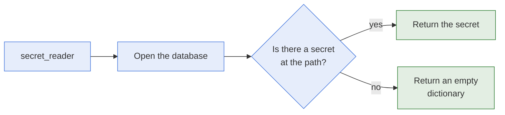

# secret_reader

- **What it is:** the module that reads one secret from a KeePass database.
- **What it returns:** the secret as a dictionary keyed by its title, with its username, its
  password, and its custom properties.
- **What it never does:** it never writes to the database, and always reports
  `changed: false`.

## Flow



## Options

| Option | Type | Required | Meaning |
| --- | --- | --- | --- |
| `db_path` | str | yes | Path of the database file. |
| `db_password` | str | yes | Password of the database. |
| `secret_path` | str | yes | Path of the secret. |

## Behaviour

- **Missing secret:** the task succeeds and returns `secret: {}`.
- **Missing database or wrong password:** the task fails.
- **Check mode:** the database is not opened, and an empty secret is returned.
- **`url`:** it is not returned.

## Return Values

| Key | Type | Meaning |
| --- | --- | --- |
| `changed` | bool | Always `false`. |
| `failed` | bool | Whether the task failed. |
| `path` | str | Path of the secret. |
| `secret` | dict | The secret, keyed by its title. See [Paths And Return Values](../architecture/paths-and-return-values.md). |

## Examples

Read a secret and use its password:

```yaml
- name: Read secret
  hasnimehdi91.keepass.secret_reader:
    db_path: "keys.kdbx"
    db_password: "password"
    secret_path: "foo/bar"
  register: bar

- name: Use the password
  debug:
    msg: "{{ bar.secret.bar.password }}"
  no_log: true
```

## Related Documentation

- [group_reader](group-reader.md), which reads every secret of a group.
- [Modules](README.md)
