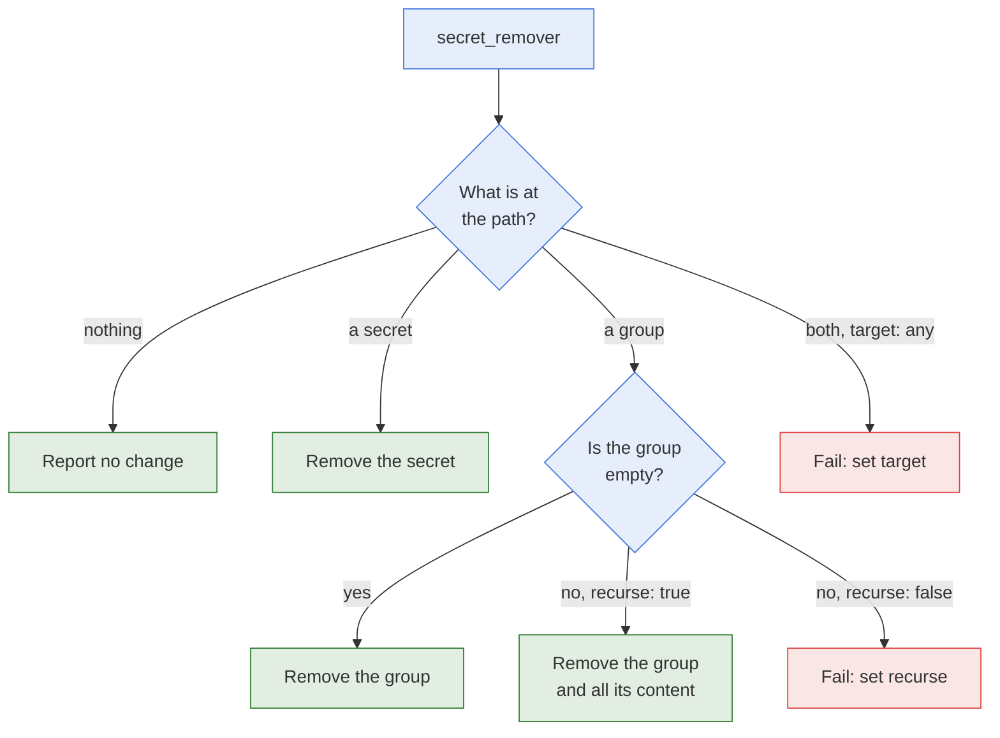

# secret_remover

- **What it is:** the module that removes a secret or a group from a KeePass database.
- **What it protects:** a group that is not empty is never removed unless you set
  `recurse: true`, and the root group is never removed.
- **What it returns:** the paths that were removed. No secret value is returned.

## Flow



## Options

| Option | Type | Required | Default | Meaning |
| --- | --- | --- | --- | --- |
| `db_path` | str | yes | | Path of the database file. The database must exist. |
| `db_password` | str | yes | | Password of the database. |
| `secret_path` | str | yes | | Path of the secret or the group to remove. |
| `target` | str | no | `any` | What may be removed: `any`, `entry`, or `group`. |
| `recurse` | bool | no | `false` | Remove a group together with its secrets and its sub-groups. |

## Behaviour

- **`target: any`:** removes the secret or the group at the path. When a secret and a group
  share that path, the task fails and asks for `target`.
- **`target: entry`:** only a secret is removed. A group at the path is left in place.
- **`target: group`:** only a group is removed. A secret at the path is left in place.
- **Group that is not empty:** the task fails unless `recurse: true`.
- **Nothing at the path:** the task succeeds with `changed: false`, so a second run is safe.
- **Permanent:** the removal does not go through the recycle bin of the database.
- **Parent groups:** removing `a/b/secret` leaves the group `a/b` in place.
- **Root group:** the path `/` fails the task.
- **File permissions:** a removal keeps the permissions of the database file. It also keeps
  its owner and its group when the user running the task is allowed to set them.
- **Missing database:** the task fails. The module never creates a database.
- **Check mode:** reports what would be removed. Nothing is written.

## Return Values

| Key | Type | Meaning |
| --- | --- | --- |
| `changed` | bool | Whether something was removed. |
| `failed` | bool | Whether the task failed. |
| `path` | str | Path given to the module. |
| `removed.entries` | list | Paths of the removed secrets. |
| `removed.groups` | list | Paths of the removed groups. |

With `recurse: true`, `removed` lists every secret and every sub-group that went with the
group.

## Examples

Remove a secret:

```yaml
- name: Remove secret
  hasnimehdi91.keepass.secret_remover:
    db_path: "keys.kdbx"
    db_password: "password"
    secret_path: "foo/bar"
```

Remove a group and all its content:

```yaml
- name: Remove group
  hasnimehdi91.keepass.secret_remover:
    db_path: "keys.kdbx"
    db_password: "password"
    secret_path: "foo"
    target: group
    recurse: true
  register: removed

- name: Show what was removed
  debug:
    var: removed.removed
```

## Related Documentation

- [secret_writer](secret-writer.md), which writes a secret.
- [Modules](README.md)
