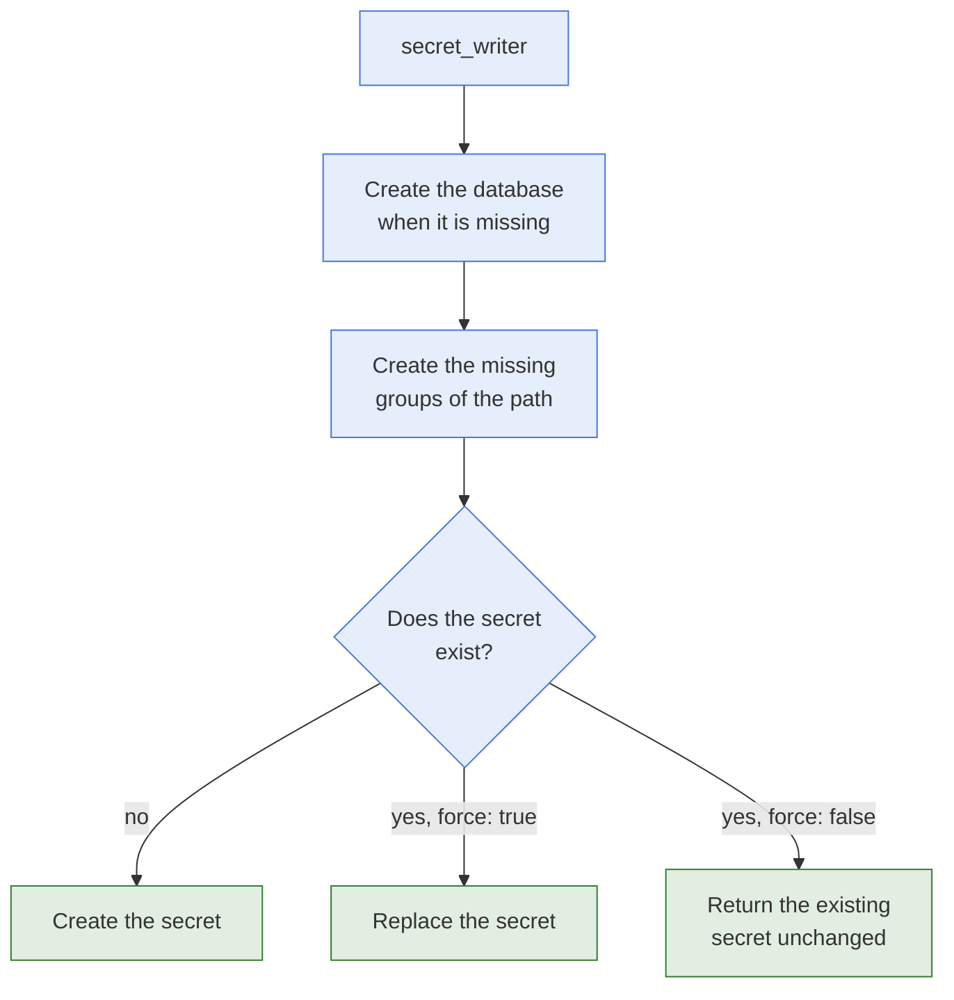

# secret_writer

- **What it is:** the module that writes a secret to a KeePass database.
- **What it creates on the way:** the groups of the path, and the database itself when the
  file does not exist.
- **What it protects:** an existing secret is never replaced unless you set `force: true`.

## Flow



## Options

| Option | Type | Required | Default | Meaning |
| --- | --- | --- | --- | --- |
| `db_path` | str | yes | | Path of the database file. |
| `db_password` | str | yes | | Password of the database. |
| `secret_path` | str | yes | | Path of the secret. |
| `secret_value` | dict | no | | The content of the secret. An empty secret is created when it is omitted. |
| `secret_value.username` | str | no | | Username of the secret. |
| `secret_value.password` | str | no | | Password of the secret. |
| `secret_value.url` | str | no | | URL of the secret. |
| `secret_value.custom_properties` | dict | no | | Custom properties of the secret. Every value is stored as text. |
| `force` | bool | no | `false` | Replace the secret when it already exists. |

## Behaviour

- **New secret:** the secret is created. `changed: true`.
- **Existing secret, `force: false`:** the secret is left as it is and returned with its
  current content, even when `secret_value` differs. `changed: false`.
- **Existing secret, `force: true`:** the secret is removed and created again with
  `secret_value`. `changed: true` on every run. The history of the old secret is lost.
- **Missing database:** it is created with `db_password`, then the secret is written. Use
  [create_database](create-database.md) to control its settings and its permissions.
- **Unknown key:** a key in `secret_value` that is not one of the four above fails the task.
- **File permissions:** a write keeps the permissions of the database file. It also keeps
  its owner and its group when the user running the task is allowed to set them.
- **Check mode:** nothing is written, and an empty secret is returned.
- **Wrong password:** the task fails.

## Return Values

| Key | Type | Meaning |
| --- | --- | --- |
| `changed` | bool | Whether the secret was written. |
| `failed` | bool | Whether the task failed. |
| `path` | str | Path of the secret. |
| `secret` | dict | The secret, keyed by its title. See [Paths And Return Values](../architecture/paths-and-return-values.md). |

`url` is stored in the database and is not part of the returned secret.

## Examples

Write a secret:

```yaml
- name: Write secret
  hasnimehdi91.keepass.secret_writer:
    db_path: "keys.kdbx"
    db_password: "password"
    secret_path: "foo/bar"
    secret_value:
      username: "John"
      password: "Doe"
      custom_properties:
        gender: "Male"
```

Replace an existing secret:

```yaml
- name: Replace secret
  hasnimehdi91.keepass.secret_writer:
    db_path: "keys.kdbx"
    db_password: "password"
    secret_path: "foo/bar"
    secret_value:
      username: "John"
      password: "NewPassword"
    force: true
```

## Related Documentation

- [secret_remover](secret-remover.md), which removes a secret.
- [Modules](README.md)
