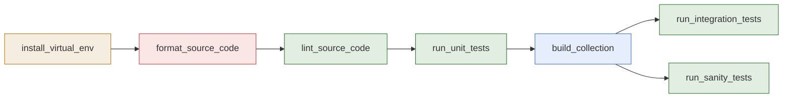

# Runbook

- **What it is:** every `make` target of the repository, in the order it is used, with what it
  does and what it changes.
- **How targets run:** from the repository root. Every target except `install_virtual_env`
  first checks that the virtual environment exists and builds it when it is missing.

## Execution Order

## Bootstrap

| Target | What it does | What it changes |
| --- | --- | --- |
| `make install_virtual_env` | Removes `ops.venv` and builds it again from `requirements.txt`. | `ops.venv/` |
| `make check_virtual_env` | Builds `ops.venv` only when it is missing. Every other target runs it first. | `ops.venv/`, only when missing |

## Source Code

| Target | What it does | What it changes |
| --- | --- | --- |
| `make format_source_code` | Formats the Python files under `plugins/`, `tests/`, and `scripts/`. | The Python files, in place |
| `make lint_source_code` | Checks the formatting and the lint rules. | Nothing |

## Tests

| Target | What it does | What it changes |
| --- | --- | --- |
| `make run_unit_tests` | Runs the unit and module tests with `pytest`. | New databases in `tests.local/` |
| `make run_integration_tests` | Builds the collection, installs it into `tests.local/collections`, and runs the integration playbook. | `dist/`, `tests.local/` |
| `make run_sanity_tests` | Builds the collection and runs `ansible-test sanity` on a temporary copy. | `dist/` |
| `make run_tests` | Runs lint, unit, integration, and sanity, in that order. | As above |

## Build

| Target | What it does | What it changes |
| --- | --- | --- |
| `make build_collection` | Packages the collection into `dist/hasnimehdi91-keepass-<version>.tar.gz`. | `dist/` |

## Wiki

| Target | What it does | What it changes |
| --- | --- | --- |
| `make build_wiki` | Builds the wiki pages from the documentation into `dist/wiki`. | `dist/wiki/` |
| `make publish_wiki` | Builds the wiki pages and pushes them to the GitHub wiki. Public. | The GitHub wiki |

## Related Documentation

- [Development Environment](development/development-environment.md)
- [Testing](development/testing.md)
- [Release](development/release.md)
- [Wiki](development/wiki.md)
